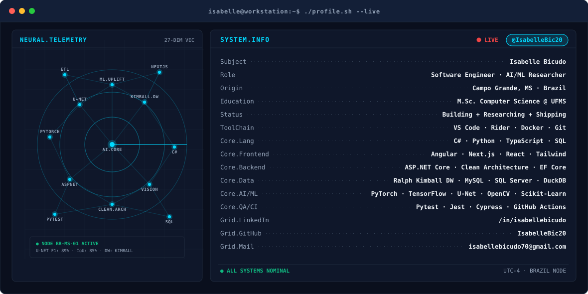
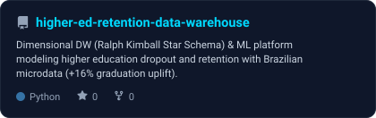
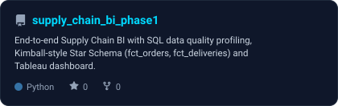

# Hi, I'm Isabelle Bicudo

<!-- BANNER - terminal profile.sh --live (adaptive). Generated by scripts/banner/generate.py. -->
<picture>
  <source media="(prefers-color-scheme: dark)"  srcset="assets/banner-dark.svg">
  <source media="(prefers-color-scheme: light)" srcset="assets/banner-light.svg">
  
</picture>

 

<!-- NAME / TAGLINE - animated typing -->

 

**Building scalable software, enterprise data warehouses & advancing AI through research**

 

<!-- SOCIALS & BADGES -->
&nbsp;&nbsp;
&nbsp;&nbsp;

  

---

## About Me

**Software Engineer & AI/ML Researcher** passionate about building production-grade systems, dimensional data warehouses, and solving complex problems with machine learning. Currently pursuing a **Master's in Computer Science** at UFMS with published peer-reviewed research in computer vision.

- 🏢 **Professional:** Full-Stack Developer @ Exbe Technology (Nov 2024 - Apr 2026)
- 📚 **Academic:** M.Sc. Computer Science @ UFMS | Published researcher in semantic segmentation & deep learning
- 🎓 **Education:** B.S. Information Systems @ UFMS
- 📍 **Location:** Campo Grande, MS - Brazil
- 💡 **Focus:** Full-Stack Development (.NET / Angular / Next.js) + AI/ML + Data Warehouse & Analytics Engineering

---

## Key Achievements

<table>
  <tr>
    <td align="center" width="25%">
      <b>📊 Peer-Reviewed Research</b> 
      Published U-Net semantic segmentation 
      <code>F1: 89% | IoU: 85%</code>
    </td>
    <td align="center" width="25%">
      <b>🏛️ Data Engineering & DW</b> 
      Kimball Star Schema DW + ML 
      <code>+16% Graduation Uplift Model</code>
    </td>
    <td align="center" width="25%">
      <b>🚀 Production Systems</b> 
      ASP.NET Core APIs + Angular/Next.js 
      Full-Stack enterprise applications
    </td>
    <td align="center" width="25%">
      <b>✅ Quality Assurance</b> 
      E2E, Unit, Integration Testing 
      CI/CD pipelines & Code Review
    </td>
  </tr>
</table>

---

## signals

<table>
<tr>
<td width="50%" align="center" valign="middle">

<!-- Self-rated skill radar - edit assets/skills.json, the workflow redraws it -->
<picture>
  <source media="(prefers-color-scheme: dark)"  srcset="assets/radar-dark.svg">
  <source media="(prefers-color-scheme: light)" srcset="assets/radar-light.svg">
  
</picture>

</td>
<td width="50%" align="center" valign="middle">

<!-- Hand-authored stack radar - edit assets/langmix.json, the workflow redraws it -->
<picture>
  <source media="(prefers-color-scheme: dark)"  srcset="assets/radar-langs-dark.svg">
  <source media="(prefers-color-scheme: light)" srcset="assets/radar-langs-light.svg">
  
</picture>

</td>
</tr>
</table>

---

## Professional Experience

### **Software Engineer @ Exbe Technology**
*Nov 2024 – Apr 2026 | Campo Grande, MS*

**Backend & APIs**
- Architected RESTful APIs using **ASP.NET Core** with Entity Framework
- Implemented SOLID principles & Clean Architecture patterns
- SQL Server database design, relational modeling & query optimization
- Git/GitHub CI/CD workflows and automated deployments

**Frontend Development**
- Built responsive components in **Angular** and **Next.js**
- TypeScript, HTML5, CSS3 with a strong focus on UX/UI performance
- Code refactoring for modularity, reusability & maintainability

**Quality Assurance**
- E2E testing (critical workflows), Unit & Integration testing
- Regression & smoke testing pipelines
- API validation & debugging in dev/prod environments

**Methodology**
- Agile (Scrum/Kanban), Code reviews, Continuous integration

---

## Academic Highlight: Published Research

### **Semantic Segmentation in Aerial Orthophotos**
*Peer-reviewed publication | UFMS*

**The Challenge:** Automated anthill detection in aerial imagery for agricultural monitoring

**The Solution:** U-Net deep learning architecture with hybrid loss function
- 📊 **Results:** F1-Score 89%, IoU 85% on 1,000+ aerial images
- 🔬 **Tech Stack:** Python, PyTorch, TensorFlow, OpenCV, Jupyter
- 📈 **Impact:** Applicable to precision agriculture & remote sensing

**🔗 Repository:** [anthill-segmentation](https://repositorio.ufms.br/handle/123456789/14577)

---

## Tech Stack

  

### Backend & API Development

### Frontend Development

### AI/ML & Data Science

### Data Engineering & Databases

### Quality Assurance & DevOps

---

## Featured Projects

<table>
<tr>
<td width="50%" valign="top">

<picture>
  <source media="(prefers-color-scheme: dark)"  srcset="assets/card-higher-ed-retention-data-warehouse-dark.svg">
  <source media="(prefers-color-scheme: light)" srcset="assets/card-higher-ed-retention-data-warehouse-light.svg">
  
</picture>

 

### 🎓 **[Higher Education Retention & Data Warehouse Platform](https://github.com/IsabelleBic20/higher-ed-retention-data-warehouse)** — *Data Engineering & Predictive ML*
End-to-end analytical Data Warehouse and Machine Learning platform modeling higher education dropout and retention dynamics using official Brazilian public microdata (IBGE & INEP).
- **Dimensional DW Architecture:** Ralph Kimball Star Schema (`dim_uf`, `dim_tempo`, `dim_universidades`, `dim_cursos`, `fato_indicadores_economicos`, `fato_indicadores_academicos`) with high-performance batch ETL.
- **Machine Learning & Simulation:** Time-series feature extraction (slope, autocorrelation, dominant frequency) + K-Means clustering (PCA), and counterfactual MLP Neural Network modeling.
- **Key Finding:** Proved an empirical **+16.0% relative increase in university graduation likelihood** for students receiving socioeconomic assistance across all 27 Brazilian states.
- **Tech:** Python, MySQL 8, Docker Compose, Scikit-Learn, Pandas, Pytest, GitHub Actions CI/CD.

</td>
<td width="50%" valign="top">

<picture>
  <source media="(prefers-color-scheme: dark)"  srcset="assets/card-supply_chain_bi_phase1-dark.svg">
  <source media="(prefers-color-scheme: light)" srcset="assets/card-supply_chain_bi_phase1-light.svg">
  
</picture>

 

### 📦 **[Supply Chain BI & Data Quality](https://github.com/IsabelleBic20/supply_chain_bi_phase1)** — *Data Stewardship & Business Intelligence*

End-to-end Supply Chain BI project simulating real-world data quality, governance, analytical modeling, and operational reporting challenges.

- **Data Quality & Governance:** SQL-based profiling across completeness, uniqueness, validity, consistency, standardization, and referential integrity, with documented DQ rules and root-cause analysis.
- **Analytical Data Modeling:** Staging layer and Kimball-style Star Schema with `fct_orders`, `fct_deliveries`, and customer, product, warehouse, supplier, and carrier dimensions.
- **BI & Metrics:** Tableau dashboard covering order performance, delivery execution, transport costs, operational status, and data quality monitoring.
- **Key Findings:** Identified and governed duplicate records, missing/orphan customer references, negative quantities, inconsistent order values, invalid delivery dates, missing transport costs, and non-standardized status values.
- **Data Stewardship:** Raw data preserved as immutable; downstream transformations are reproducible, traceable, and documented through explicit DQ flags and business rules.
- **Dashboard:** [View the interactive Tableau Public dashboard](https://public.tableau.com/views/SupplyChainBI/SupplyChainBIOperationsDataQuality)
- **Tech:** DuckDB, SQL, Python/Pandas, Tableau Public, Git/GitHub, Markdown.

</td>
</tr>
<tr>
<td width="50%" valign="top">

### 🐜 **[Anthill Segmentation](https://repositorio.ufms.br/handle/123456789/14577)** — *Published Research*
Deep learning solution for automated anthill detection in aerial imagery
- **Achievement:** Peer-reviewed publication with 89% F1-Score
- **Architecture:** U-Net with skip connections, hybrid loss function
- **Dataset:** 1,000+ aerial images with cross-validation
- **Tech:** Python, PyTorch, TensorFlow, Jupyter

</td>
<td width="50%" valign="top">

### 💉 **[VetVaccination System](https://vet.gfcode.com.br/login)** — *Production Application*
Full-featured veterinary clinic management with automated alerts
- **Features:** Animal registry, vaccination tracking, automatic reminders, reporting
- **Deployment:** Live at https://vet.gfcode.com.br/login
- **Tech:** C#, .NET, SQL Server, Admin dashboard
- **Impact:** Real-world veterinary clinic solution

</td>
</tr>
</table>

---

## Education

**Master of Science in Computer Science**  
🏫 Federal University of Mato Grosso do Sul (UFMS) | 2024 – Present

**Bachelor of Science in Information Systems**  
🏫 Federal University of Mato Grosso do Sul (UFMS) | 2021 – 2026

**Technical Degree in Information Technology**  
🏫 Federal Institute of Mato Grosso do Sul (IFMS) | 2017 – 2019

---

## Certifications

🏆 **Data Science & Power BI Modeling** (125 hours)  
ETL, Dashboard Development, KPI Analysis, Business Intelligence

👩‍🏫 **Programming Logic Mentor** @ UFMS  
Technical mentorship & algorithm learning support

---

## Let's Connect

I'm always open to collaboration on:
- 💻 Full-stack software projects
- 🤖 AI/ML & computer vision initiatives
- 🏛️ Data Warehouse & Data Engineering architectures
- 🎓 Research collaborations
- 🚀 Innovative tech solutions

 

**Let's build something amazing together!** 

---

Last updated: September 2026 | Always learning, always building 

